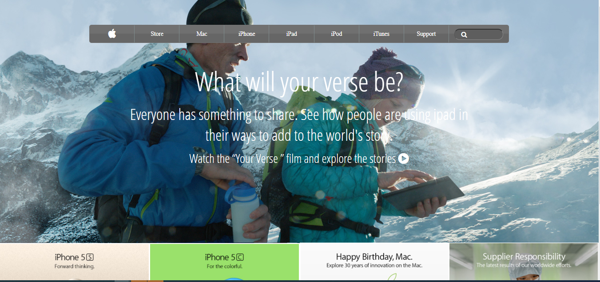

# BACKGROUND AND GRADIENTS

> Learning how to use background gradients in a page.

This project consists of building a webpage using images as a background and adding gradients to elements. The goal is to make a clone of old an old version of the Apple website webpage.

## Built With

- html, css

## Live Demo

[Live Demo Link](https://rawcdn.githack.com/okikiola11/apple-clone/e82a709d7b2f4bdf93dfa942619334806c2f4530/index.html)

## Getting Started

To get a local copy up and running follow these simple example steps.

### Prerequisites
- Web browser
- Code editor
- Git and Github

### Usage
- Clone the project to your local machine 
- Open the index file in your browser

## Authors

- Okikiola Apelehin

👤 **Author1**

- Github: [@okikiola Apelehin](https://github.com/okikiola11)
- Twitter: [@okikiola Apelehin](https://twitter.com/Kikiolla3)
- Linkedin: [okikiola Apelehin](https://www.linkedin.com/in/okikiola-apelehin-459008122/)

## 🤝 Contributing

Contributions, issues and feature requests are welcome!

Feel free to check the [issues page](https://github.com/okikiola11/apple-clone/issues).

## Show your support

Give a ⭐️ if you like this project!

## Acknowledgments

- Google

